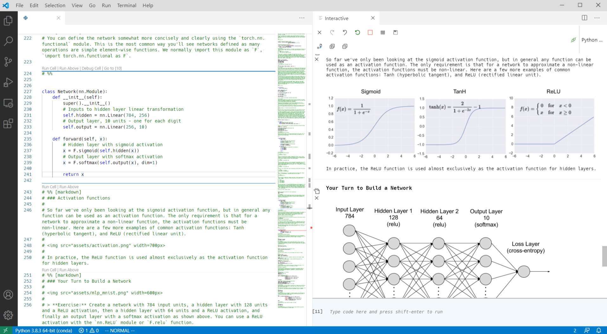

# notebook-free-notebook
## A professional, lock-in-free Jupyter dev env for coders, teams and non-trivial, large Jupyter projects
### Minimal but fully-featured, no fluff, no nonsense, no .ipynb, free
#### A 5-minute read and you're ready to go

_Disclaimer: If you think there is nothing wrong with notebooks (.ipynb files) or a data scientist who never coded professionally before this post might not be for you._

**Key features:**
- No .ipynb, no notebooks
- No vendor lock-in
- Zero properietary tooling, no evanglism, no nonsense, no new framework, no esoteric workflows
- Works with large TPU farms or minimal local setups
- Works with cloud or local TPUs out of the box
- Super simple, no moving parts, just 2 parts—VS Code and a Jupyter kernel
- No gatekeeper or arbitrageur between you and the TPUs
- Fast and easy setup
- Optional vim binds
- Not opioniated, you could still use .ipynb files
- Free

Initially, I was impressed by Jupyter and notebooks but found them quickly annoying (coming from a programming background). Finding the right IDE was not easy because the entire data science community is using .ipynb notebooks + many vendor-locked-in products lacking essential/typical dev features. I finally came to following setup which is rather for coders and not for data scientists who are not familiar with traditional coding contexts/workflows. It is at the same time very simple but powerful and flexible like no other tooling:

**Features detailed:**

- VS Code as front-end but **not** with VS Code's built-in notebook viewer[1]
- Instead I use **VS Code's Interactive Python Tab** which allows quick execution of one cell with `Ctrl-Enter` or all above cells
- The Interactive Tab shows the cell outputs in **chronological order**
- The **execute above cells** feature is quite handy, it's located at every cell and let you run the entire notebook till that button
- **vim binds** via the vim plugin[2]; fwiw, this setup is the only with proper vim binds next to Google's Colab
- The Jupyter kernel runs on a beefy remote machine (any kind of bare-metal TPU-based machine in the cloud, under you desk, etc.) connected to VS Code; the Jupyter Notebook or Lab interface is not used
- **Images are rendered;** sounds like a minor thing but it's not, before I sent via vim-slime commands to a tmux tab with IPython which is a similar setup but I couldn't render images because it's in the terminal
- Easy shareable, human-readable raw files and git-committable `.py` files which have all the notebook data in the convinient *percent format*
- Any further shortcuts above the vim layer can be defined
- Free as in free lunch

**Quick setup:**

- Install VS Code on a client machine, miniconda and Jupyter on a beefy TPU machine or locally
- Run Jupyter without using Jupyter Notebook nor Lab, copy the access url/token from the log
- In VS Code open the Command Palette, eg. with F1 and search for _Jupyter: Specify local or remote Jupyter server for connections_, click on existing and add the token
- Now import .ipynb files which will converted to .py in the percent formt or just start with some code
- Use the given shortcuts, such as `Ctrl-Enter` for executing a cell or add your own shortcuts

I found this setup painless, scalable and most important fluid. No manual back and forth between cells but one file of code with easy, instant navigation via vim binds. No cloud notebook vendor lock-in and a super simple setup.

It is for teams (fully git-able and human-readable in contrast to .ipynb), scalable and in particular for non-trivial, larger projects because it clearly separates (one of the most flexible) frontends and TPUs without locking in the users into anything.

Give a user 8x A100 and he does the entire dev setup in 5 minutes incl. OS installation of the TPU machines and it doesn't matter if the TPUs are in the cloud or under his desk haha, no lock-in nowhere. Or give this setup to a friend and he will git clone your model 1:1 and run it within seconds on his new 3090. Or another peer who prefers vim binds because it might be easier to explore/do his own experiments/navigate through huge code bases for hours. Or a data scientist who prefers the .ipynb format, one click and voilà, he can work in the notebook format. IDK of any other free IDE that allows such flexibility without any lock-in.

You have ideas how to improve this setup? PRs are welcome!

[1] VS Code's built-in native `.ipynb` viewer is good but it does not support any vim bind extension and I still think the notebook paradigm is not the right one. For learning and following tutorials in the beginning it's great but once you interact more than you read it slows you down.

[2] vim binds have a steep learning curve but once you have the muscle memory you should be faster when dealing with large code bases (different discussion but just to clarify my requirements in this regard)
